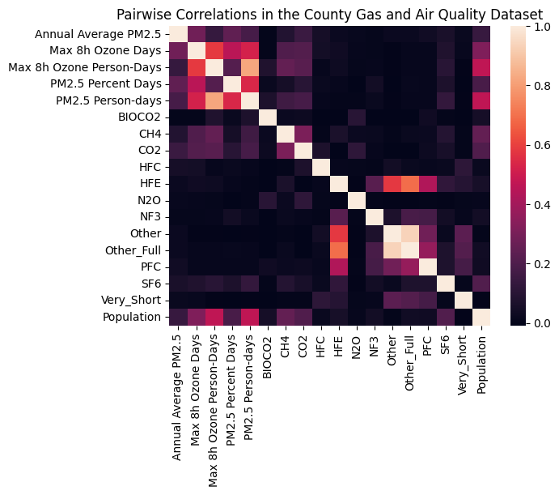
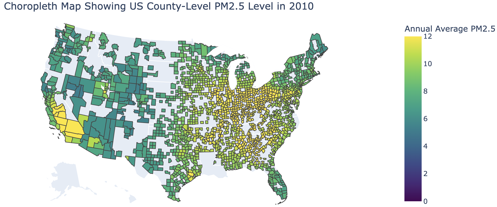

# Utilizing Machine Learning Models for Real-World Air Quality Analysis
Demo in YouTube: https://www.youtube.com/watch?v=T06xX9X0MH0 

## Overview
This project investigates the relationship between industrial facilities, greenhouse gas emissions, population density, and air quality in various US counties using **machine learning models** and **data analysis techniques**. 

## Data Preparation
1. We cleaned and merged datasets from the `EPA's Greenhouse Gas Reporting Program (GHGRP)` and `Air Quality System (AQS)`, as well as `population estimates for US counties`. This process included **renaming columns for readability**, **filtering top air quality measures**, **synchronizing datasets by common years and states**, and **merging them** based on common identifiers such as 'State' and 'County'. The final result was two comprehensive DataFrames: `facility_gas` (for **Model 1**) and `county_gas_air_quality` (for **Model 2**).
2. We randomly splitted both DataFrames into training and testing sets using the same approach: 70% for training sets and 30% for validation set (using `train_test_split` function from `sklearn.model_selection`).

## Feature Engineering
 Key steps included **aggregating emissions data by facility and year**, **merging these aggregates with county population data**, and **creating a pivot table for air quality measures**. 
 - For model 1, we applied **standarization of features** by subtracting the mean and scaling to unit variance (`preprocessing.StandardScaler` from `sklearn`). 
 - For model 2, we performed **one-hot encoding** on major industry types and **categorized** the percentage of days with PM2.5 levels into three severity levels: Good, Moderate, and Poor. We also **standardized** the non one-hot encoded features. 
 These features were crucial for building predictive models.

## Machine Learning Modeling
Two machine learning models were constructed to address our research questions
- Model 1: The first model aimed to predict the industry type of facilities based on their gas emissions. We used the standarized training data to train the first **logistic regression model** (using`LogisticRegression` from `sklearn`) and evaluated the model performance using training and validation datasets. 
- The second model aimed to predict county air quality levels based on the sum of gas emissions, population density, and major industry types. We used **one-hot coding** data, non-hot coding training dataset to train the second **logistic regression model** and to determine which level of air quality they are mostly associated with. We evaluated the model performance using training and validation datasets.

## Model performance evaluation and Conclusion
Hyperparameter tuning was performed to optimize the performance of both models. For the logistic regression models, we standardized features and evaluated performance using precision and recall metrics. 
### Model 1 Performance
**Training Accuracy**: 0.8133481646273637  
**Validation Accuracy**: 0.7612869745718733

| Class                                  | Precision | Recall | F1-Score | Support |
|----------------------------------------|-----------|--------|----------|---------|
| Crude Petroleum and Natural Gas Extraction | 0.91      | 0.06   | 0.11     | 356     |
| Fossil Fuel Electric Power Generation   | 0.70      | 1.00   | 0.82     | 830     |
| Solid Waste Landfill                    | 0.86      | 0.83   | 0.85     | 741     |
| **Accuracy**                            |           |        | 0.76     | 1927    |
| **Macro Avg**                           | 0.82      | 0.63   | 0.59     | 1927    |
| **Weighted Avg**                        | 0.80      | 0.76   | 0.70     | 1927    |

_An accuracy exceeding 75% suggests that appropriate features were selected to predict facility industry type. The discrepancy between the training and testing datasets indcaites that the model is slightly overfitting._

### Model 2 Performance
**Training Accuracy**: 0.7881308929561841  
**Validation Accuracy**: 0.7868217054263565

| Class      | Precision | Recall | F1-Score | Support |
|------------|-----------|--------|----------|---------|
| Good       | 0.80      | 0.98   | 0.88     | 600     |
| Moderate   | 0.25      | 0.03   | 0.05     | 103     |
| Poor       | 0.57      | 0.24   | 0.34     | 71      |
| **Accuracy**   |           |        | 0.79     | 774     |
| **Macro Avg**  | 0.54      | 0.42   | 0.42     | 774     |
| **Weighted Avg** | 0.71      | 0.79   | 0.72     | 774     |

_The minor discrepancy between the training and validation datasets indicates that the model is not overfitting. An accuracy excedding 75% suggests that appropriate features were selected. As accuracy alone cannot comprehensively represent a model's model performance, particuarly given the data distribution heavily skew torwards the "Godd" category, Precision and Recall metrics were also employed to analyze Model 2's performance._

Additionally, we explored the corrlations between different features related to air quality and gas emission using corrlation analysis. We visualized teh relationship between variables in the datasets. There is a certain correlation betwen air quality measurements, and there is also a certain correlation between population and air quality indicators. 

To better understand air quality in the US, we created a choropleth map of the Annual Average PM2.5 level for each county in 2010. It is worh noting that the air quality in the estern and western regisons of the central US was poor. 

Overall, the study highlights the significant impact of industrial activities and population density on air quality. The two maching learning models we established from this project can be used to predict air quality based on different factors, based on the data being provided in the future. The models developed provide valuable insights for policymakers to mitigate air pollution through targeted industrial regulation and management.

### Libraries utilized: 
`pandas`, `seaborn`, `matplotlib`, `numpy`, `sklearn` (including `linear_model`, `model_selection`, `metrics`, and `preprocessing`)

### Dataset Used
1. **EPA's Greenhouse Gas Reporting Program (GHGRP)**: Includes datasets `us_greenhouse_gas_emissions_direct_emitter_facilities.csv` and `us_greenhouse_gas_emission_direct_emitter_gas_type.csv`, detailing greenhouse gas emissions reported by facilities.
2. **EPA's Air Quality System (AQS)**: Contains `us_air_quality_measures.csv`, providing air quality measurements on a county level from approximately 4000 monitoring stations across the US.
3. **Population Estimates**: The dataset `PopulationEstimates.csv` provides population estimates and Federal Information Processing Standards (FIPS) codes for US counties in 2010.